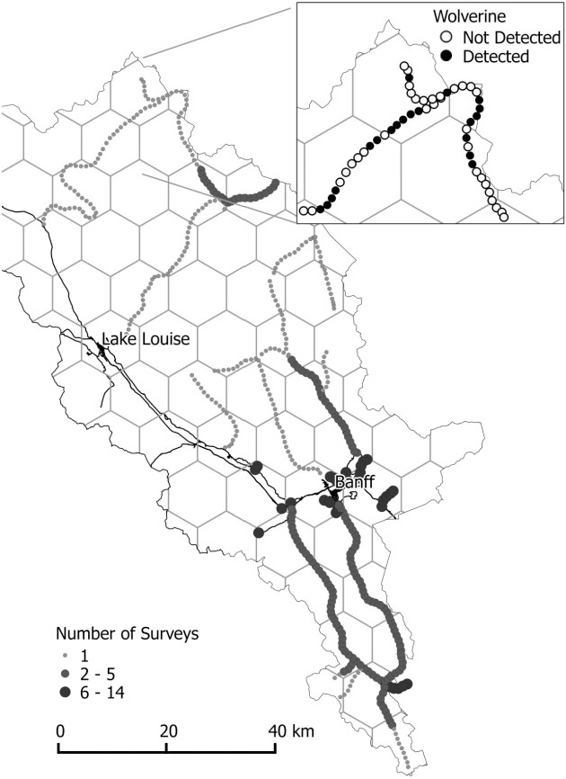

date: 2019-12-03
title: Estimating occupancy using spatially and temporally replicated snow surveys 
tags: Occupancy models
Category: Review

**Обзор основных методов статьи 
[J. Whittington, K. Heuer, B. Hunt, M. Hebblewhite, and P. M. Lukacs, 
“Estimating occupancy using spatially and temporally replicated snow surveys: Estimating occupancy by snow surveys,” 
Anim Conserv, vol. 18, no. 1, pp. 92–101, Feb. 2015.](https://zslpublications.onlinelibrary.wiley.com/doi/abs/10.1111/acv.12140)**

## Суть задачи
Нужно разработать методику подсчета числа особей определенных видов животных на некой территории, используя наблюдения следов животных. В статье разобран пример на россомах и рысях в Национальном парке Банф (Канада).

## Сбор данных

### Как делили территорию
Всю территорию Национального парка поделили на правильные шестиугольники (ячейки) площадью 100 кв. км. (площадь базового участка зависит от подвижности вида). Затем по территории проложили лыжные маршуты и ходили по ним с февраля по апрель. Каждый маршрут разделили на километровые сегменты, в каждом сегменте отмечали присутствие или отсутствие каждого вида.

На следующей карте показаны шестиугольники и маршруты с указанием того, сколько раз был обследован каждый сегмент. Каждая точка на карте отмечает сегмент в один километр, закрашеные точки отмечают присутсвие следов россомахи в данном сегменте.

### Что и как собирали
На маршруте исследователи должны были для каждого сегмента отметить:

 * присутствие/отсуствие следов каждого анализируемого вида;
 * оценочное число дней $DaysSnow$, в течение которых могли быть заметны следы присутствия животных (зависело от интенсивности снегопадов, солнечной и ветренной погоды), для каждого вида это число дней подбиралось индивидуально (некоторые следы держатся дольше, некоторые меньше). Авторы пишут, что они при дальнейших расчетах центрировали $DaysSnow$ вокруг среднего (получились разные центры для копытных и хищников) и поделили на стандартное отклонение.
 

## Вычисления

Авторы использовали четыре модели, описывающие различные предположения о структуре зависимостей данных: с учетом и без учета пространственныых и временных автокорреляций.

Обозначения:

 * $y_{ijk}$ -- были ли обнаружены следы присутствия животного в ячейке номер $i$, на $j$-м километре (сегменте) пути в ходе $k$-го по счету исследования;
 * $\psi$ -- вероятность того, что животное находилось в ячейке;
 * $p$ -- вероятность того, что были детектированы следы присутствия животного, при условии, что оно находилось в ячейке;
 * $M$ -- число обследованных ячеек.
 
Основные предположения:
 * факт того, что в некоторой ячейке находится животное, не зависит от того, есть или нет животное в других ячейках;
 * животные не перемещаются между ячейками в течении процедуры исследования.
 
При таких предположениях наличие животных в ячейках можно смоделировать на базе схемы испытаний Бернулли, а величина $\psi$ в таком случае будет пропорцией занятых ячеек. Авторы моделируют $\psi$, вероятность присутствия животного в ячейке, в виде логистической функции от параметров среды:

$$
logit(\psi) \equiv \log\left( \frac{\psi}{1 - \psi} \right) = \beta_{\psi}
$$

Затем строятся функции правдоподобия $L$, различающиеся лежащими в их основе предположениями о зависимостях.

### Модель 1
В основу модели была положена разработка из [1].

Функция правдоподобия согласно данной модели вычисляется по формуле:

$$
L(y | \psi, p) = \prod_{i=1}^M \left\{ Bin(y_i | K, p)\psi + I(d_i =0)(1-\psi) \right\},
$$

здесь $y_i$ -- число, означающее сколько раз было детектировано животное в ячейке $i$ в течении $K$ посещений ячеки; $d_i$ означает общее количество обнаружений животного в ячейке $i$; $I(.)$ -- индикаторная функция, принимающая значение 1, если аргумент истинный и 0 в противном случае.

Первое слагаемое внутри скобок представляет собой вероятность того, что ячейка была занята животным, она рассчитывается по биномиальной модели. Второе слагаемое описывает ячейки, в которых животные не были обнаружены и в которых действительно нет животных.

*Замечание 1 (КД):* Немного странная формула. Больше похоже на то, что она описывает не функцию правдоподобия обнаружения, а функцию правдоподобия *не обнаружения*. В о всяком случае слагаемое $I(d_i =0)(1-\psi)$ означает именно это: вероятность необнаружения животного при условии, что оно действительно отсутствует в ячейке. Логично тогда его складывать с *вероятностью необнаружения* животного при условии, что оно там присутсвует, т.е. $Bin(y_i | K, p)\psi$ должно быть вероятностью *пропуска* следов животного.

*Замечание 2 (КД):* В исходной статье, на которую ссылается J. Whittington и соавторы, приводится совсем другая функция правдоподобия (если привести ее в соответствии с обозначениями данной статьи):
$$
L(y | \psi, p) = \left [ \psi^{y_i} \prod_{i=1}^K p^{d_i} (1-p)^{K-d_i} \right ] \times \left [\psi \prod_{i=1}^K (1-p) + (1-\psi) \right]^{K-d_i}
$$
Как видим, здесь второе произведение означает именно суммарную вероятность того, что животное *не будет обнаружено* в ходе $K$ посещений ячейки.
К сожалению,  J. Whittington и соавторы не дают ни малейшего намека, как они получили свою формулу из исходной. 

### Модель 2
Данная модель разработана J. Whittington и соавторами и исходит из предположения, что вероятность детекции следов животного для различных ячеек и различных посещений ячейки независимы друг от друга и взаимозаменяемы:
$$
L(y | \psi, p) = \prod_{i=1}^M \left\{ \left ( \prod_{j=1}^{J_i} \prod_{k=1}^{K_{ij}} p_{ijk}^{y_{ijk}} (1-p_{ijk})^{1-y_{ijk}}   \right) \psi + I(d_i =0)(1-\psi) \right\}.
$$
где $logit(p_{ijk}) = \alpha_{intercept} + \alpha_{DaysSnow} DaysSnow_{ijk}$. Что такое $J_i$ авторы не говорят, но можно предположить, что это число километровых сегментов, лежащих на маршруте внутри ячейки $i$, аналогично можно предположить, что $K_{ij}$ -- число сегментов, пройденных в ходе $k$-го посещения ячейки $i$.

*Замечание 3 (КД):* Похоже, в статье есть опечатка в этой формуле: в ней был пропущен еще знак произведения "$\prod_{i=1}^M$", вычисляющий произведение вероятностей по всем ячейкам. Выше я привожу исправленную формулу.

*Замечание 4 (КД):* Авторы утверждают, что данная модель основывается на модели из [2]. Стоит поднять эту статью, если придется разбираться в данной методике глубже.

### Модель 3
Данная модель устроена по типу Модели 2 за исключением того, что вероятность детекции считается авторегрессионной (по пространственным координатам). Т.е. они вводят такое условие:
$$
logit(p_{ijk}) = \alpha_{intercept} + \alpha_{ylag} y_{i, j-1, k}+ \alpha_{DaysSnow} DaysSnow_{ijk}.
$$
Для самой первой ячейки маршрута не определено, есть ли в предыдущей (т.е. необследованной) ячейке следы присутствия животных или нет. Авторы предлагают использовать взвешенное среднее для вероятности детекции этой ячейки.

Данная модель, как и последующая, четвертая, моделирует наличие животных на двух масштабных уровнях: на уровне ячейки и на уровне сегмента маршрута.

В данной модели предполагается, что если в ячейке находится животное (следы), то для сегментов маршрута можно указать условную вероятность присутствия животного $\theta = Pr(\text{segment is occuped}| \text{cell is ocupped})$. Считается, что вероятность присутствия животного в одном сегменте не влияет на вероятность присутствия животного в других сегментах маршрута для данной ячейки (более того, она одинаковая для всех ячеек, где присутствуют животные). Соотвественно, $\psi \theta$ -- вероятность того, что в сегменте будут находиться следы животного.

Для вычисления вероятности детекции животного используются множественные обследования сегментов (т.е. проходы по ним несколько раз). Вероятность $\theta$ ищется в форме $logit(\theta) = \beta_{\theta}$. Итоговая модель выглядит следующим образом:

$$
L(y | \psi, p, \theta) = 
	\prod_{i=1}^M \left\{ 
			\prod_{j=1}^{J_i} 
				\left ( \Big[ 
					\prod_{k=1}^{K_{ij}} p_{ijk}^{y_{ijk}} (1-p_{ijk})^{1-y_{ijk}}   
				\Big] \theta 
				+ I(d_{ij} =0)(1-\theta) 
		\right )\psi
		+ I(d_i = 0)(1-\psi)
	\right\}.
$$
Здесь $d_{ij}$ должно означать, сколько раз были встречены следы животного на сегменте $j$ ячейки $i$ (правда, авторы не пишут, что стоит за этим символом).

### Модель 4
Это расширение Модели 3. Здесь вероятность присутсвия животного в ячейки счтитается авторегрессивной, точнее, зависящей от наличия животного в предыдущем сегменте:
$$
logit(\theta) = \beta_{\theta} + \beta_{\theta} \Phi_{ij-1},
$$
где $\Phi$ -- скрытая переменная, означающая находилось ли животное в предсшествующем сегменте. Авторы ссылаются на работу [2], за тем отличием, что в Модели 4 присутствуют повторные испытания во времени (повторные проходы по ячейкам).

## Дальнейшие действия
В этом разделе очень сжато описываю содержание остальной части статьи:

 * Параметры моделей авторы вычиляли в R, используя Байесовский подход и классический метод максимального правдоподобия.
 * Далее авторы исследовали вопрос взаимосвязи пространственной и временной корреляции, насколько пространсвенная репликация может быть заменена временной и наоборот. Для проверки авторы использовали компьютерную симуляцию (задавали параметры распределения и смотрели предсказанные статистики).
 * Затем авторы произвели подсчеты числа занятых животными ячеек, основываясь на описанных выше моделях и собранных данных.

## Основные ссылки
[1] MacKenzie, D.I., Nichols, J.D., Lachman, G.B., Droege, S., Andrew Royle, J. & Langtimm, C.A. (2002). Estimating site occupancy rates when detection
probabilities are less than one. Ecology 83, 2248–2255.

[2] Hines, J., Nichols, J., Royle, J., MacKenzie, D., Gopalaswamy, A., Kumar, N.S. & Karanth, K. (2010).
Tigers on trails: occupancy modeling for cluster sampling. Ecol. Appl. 20, 1456–1466.

# Комментарии
Статья выглядит довольно неопрятно с математической точки зрения, и дело тут не столько в опечатках внутри формул, сколько в том, что авторы не всегда описывают, что обозначают те или иные символы внутри выражений, в итоге читателю приходится догадываться об из значении по смыслу. Более того, авторы ссылаются на формулы в других работах, которые в цитируемой статье или отсутствуют, или означают иное (см. Замечание 2). Как минимум эти недочеты или ошибки должны были быть исправлены еще на этапе рецензирования работы, они очень подрывают доверие ко всей работе. Поэтому я бы не рекоммендовал глубоко копаться в формулах данной статьи, и считаю, что лучше обратиться к сразу к первоисточникам: данная работа годится для составления общего впечатления о методике, но не о деталях вычислений и лежащих в основе методики предположений и ограничений.
