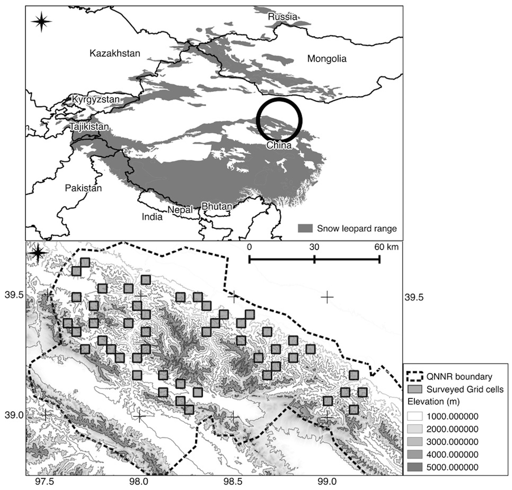

date: 2019-12-04
title: Patterns of Snow Leopard Site Use in an Increasingly Human-Dominated Landscape
tags: Occupancy models
Category: Review

**Обзор основных методов статьи 
[J. S. Alexander, A. M. Gopalaswamy, K. Shi, J. Hughes, and P. Riordan, “Patterns of Snow Leopard Site Use in an Increasingly Human-Dominated Landscape,” PLoS ONE, vol. 11, no. 5, p. e0155309, May 2016.
](https://journals.plos.org/plosone/article?id=10.1371/journal.pone.0155309)**

## Суть задачи
Исследуется распространение снежного барса (ирбиса) в условиях (а) сильного антропогенного влияния на территорию, (б) информации о присутсвии видов, которыми питаются барсы.

Но из всей статьи нас интересуют в основном схемы организации экспериментов, сбора данных и вычислительные особенности моделей распространения, поэтому обзор производится с этой точки зрения.

## Сбор данных

### Как делили территорию
Исследуемая территория находится в провинции Ганьсу (север центральной части Китая), см. схему ниже. 

В области интересов были размещены несколько квадратов (ячеек) размером в 16 кв.км., их площадь выбиралась исходя из того, что это минимальный размер "собственного участка" животного (home range). Всего было построено 212 ячеек из которых было выбрано случайным образом 49 штук для дальнейшего обследования. Некоторые квадраты попали в недоступную для людей зону, в этом случае выбирался соседний квадрат, ближайший к дороге.

{width=90%}

### Что и как собирали
В течении зимы 2014-го года с января по март исследователи ходили по выбранных квадратам. В каждом квадрате в течении дня проходили маршрут длиной 3-7 км. Эти маршруты планировались заранее так, чтобы минимизировать возможное влияние пространственной автокорреляции и обеспечить адекватное задаче покрытие квадрата.

Каждый километр маршрута был разделен на сегменты размером 10x100 метров. В каждом сегменте отмечалось присутствие или отсутствие следов самого животного и следов присутвия видов-жертв, в расчет брались следы относительно недавнего присутствия (не более месяца). В итоге получалась бинарная величина по каждому виду присутсвует/остуствует для каждого сегмента.

## Вычисления
Количество объясняющих переменных было сброшено до 3х из-за малой выборки (49 ячеек), объясняющие переменные были подобраны по данным предсшествующих иследваний. Таким образом были выбраны: наличие добычи, наличие домашнего скота, расстояние до больших промышленных объектов.

Вычисления проиводились в программе PRESENCE версии 8.8 [1]. Сравнение моделей и выбор из альтернативных моделей происходило на базе AIC.

Как таковые методы анализа в статье не описаны, в нужных местах просто даются ссылки на литературу для более глубокого погружения в тему. Основное что использовалось авторами:
 
 1. Строилась модель на основе [2], в которой в явном виде учитывается пространственная автокорреляции.
 2. Затем строилась модель из [3].
 3. Строилась модель из [4].
 
После сравнения результатов работы моделей пришли к выводу, что модель на базе [2] оказалась лучше для собранных данных. В итоге на следующих этапах исследования использовалась только эта модель.

Далее авторы использовали выбранные предикторы (наличие добычи, скота, расстояния), и вероятность детекции следов животного моделировалась функцией этих предикторов, построенной по методу, описанному в [5]. После оценки вероятности детекции и выбора оптимальной модели для нее авторы пересчитали вероятность присуствия животного в ячейки пользуясь подходом, описанным в [5].

Статья содержит большое число результатов экспериментов, но для наших целей (выявление условий применимости методов) эти результаты можно исключтить из обзора.

## Основные ссылки
[1] Hines JE (2006) PRESENCE2—Software to estimate patch occupancy and related parameters. Avail-
able: http://www.mbr-pwrc.gov/software/presence.html.

[2] Hines JE, Nichols JD, Royle JA, MacKenzie DI, Gopalaswamy AM, et al. (2010) Tigers on trails: occu-
pancy modeling for cluster sampling. Ecol Appl 20: 1456–1466. PMID: 20666261

[3] MacKenzie DI, Nichols JD, Lachman GB, Droege S, Andrew Royle J, et al. (2002) Estimating site occu-
pancy rates when detection probabilities are less than one. Ecology 83: 2248–2255

[4] Royle JA, Nichols JD (2003) Estimating abundance from repeated presence-absence data or point
counts. Ecology 84: 777–790.

[5] Karanth KU, Gopalaswamy AM, Kumar NS, Vaidyanathan S, Nichols JD, et al. (2011) Monitoring 
carnivore populations at the landscape scale: occupancy modelling of tigers from sign surveys. J Appl Ecol
48: 1048–1056.

# Комментарии
Статья не практически не содержит формул и описания условий применимости, но зато представляет неплохое словесное описание методики со ссылками на источники. Поэтому за деталями о лежащих в основе гипотезах и моделях следует идти в исходные работы.
