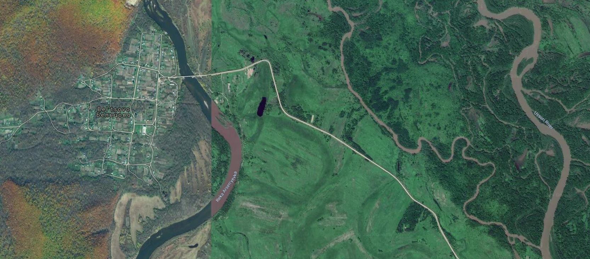
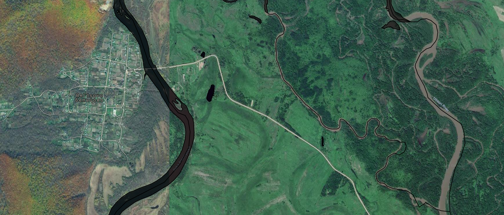
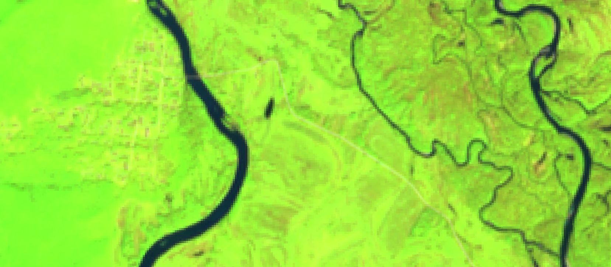
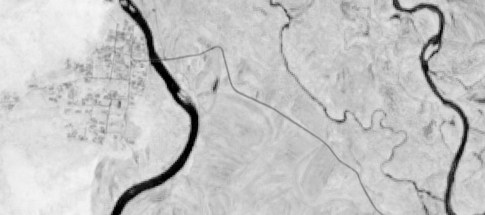
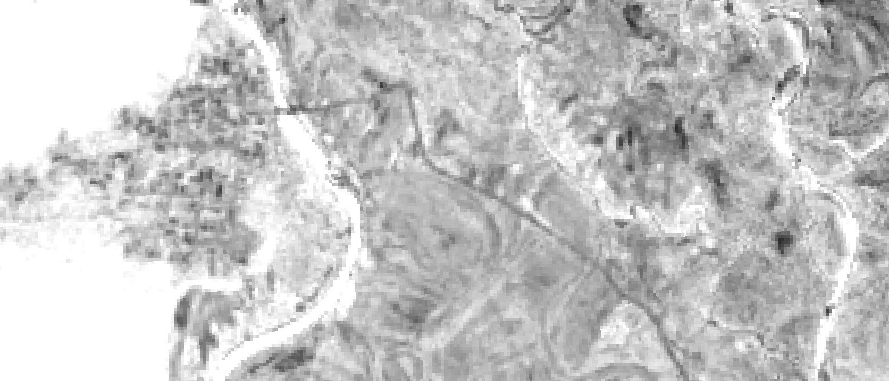
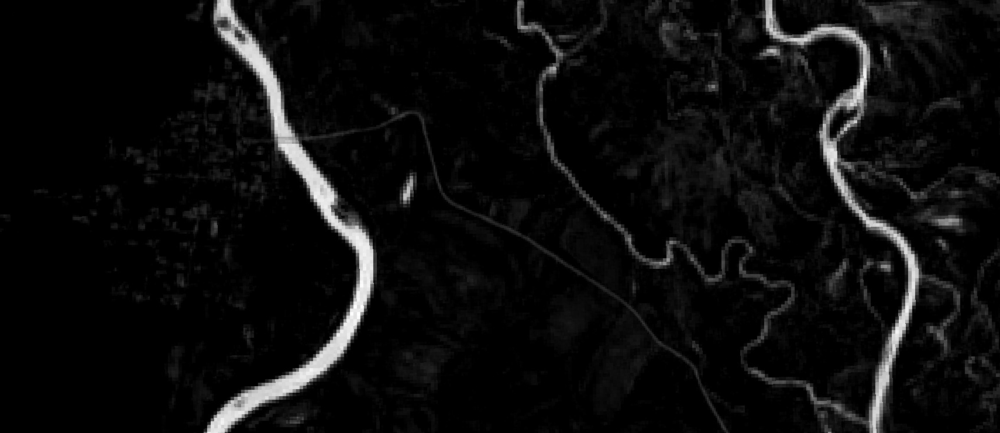

date: 2019-12-09
title: Предобработка данных Sentinel-2 в Google EarthEngine
tags: Sentinel-2, Remote Sensing, GEE
Category: Google EarthEngine tools

# Задача

Есть большая задача -- построение маски водных объектов по данным ДЗЗ, точнее Sentinel-2. Эта задача разбивается
на множество отдельных подзадач, в частности сейчас решаем вопрос о сборе обучающих данных для алгоритмов маскирования.

Для решения этой частной задачи нужно собрать данные Sentinel-2 на интересующую нас территорию и:

 * удалить с них облака (возможно, и другие шумы);
 * сделать временнУю аггрегацию по каждому каналу за определенный период времени (или несколько периодов);
 * подключить дополнительные данные (например, по рельефу), если они нужны.

Основная задача -- максимально быстро получить первый вариант классификатора, чтобы затем, пользуясь его результатами
начинать собирать обучающие данные и дополнять их.


# Ход работ

## 1. Обучающие данные в первом приближении.

В первом приближении водные объекты можно взять в OSM. Они не полные, местами не совпадают с реальными положениями рек (особенно мелких) на снимках, но это очень хороший старт.

Таким образом были импортированы из ОСМ данные по:

 * прибрежная зона;
 * площадные объекты внутри суши (озера, крупные реки);
 * линейные объекты.


## 2. Предобработка снимков

Предобработка укладывается в несколько строчек кода в Google EarthEngine. Фильтрацию облачности оставимна откуп каналу QA, который содержит бинарные маски облачности. Функция  filterCloudSentinel2 анализирует этот канал и маскирует пиксель, если он был помечен облачным в QA. Далее происходит выбрка снимков по датам и географическому охвату.

Для выбранных снимков производится маскирование облачности и рассчет медианы. Это позволяет по-быстрому избавиться от случайшных флуктуаций в данных получить более устойчивое к шумам изображение. И, наконец, строятся три индекса NDVI, NDWI1 и NDWI2. Первый индекс классический, предназначенный для анализа растительности, а второй и третий -- для анализа воды в листьях и грунте. Думаю, что добавление таких индексов в анализируемый стек каналов может увеличить точность работы (но это не точно )) -- проверим на следующем этапе).


```{javascript}
var waterPoly = ee.FeatureCollection("users/.../waterPolyPrim");

var filterCloudSentinel2 = function(img) {
  /*
  Bitmask for QA60

    Bit 10: Opaque clouds
        0: No opaque clouds
        1: Opaque clouds present
    Bit 11: Cirrus clouds
        0: No cirrus clouds
        1: Cirrus clouds present
  */
  
  var quality = img.select('QA60').int();
  var cloudBit = ee.Number(1024);    // ee.Number(2).pow(10);
  var cirrusBit = ee.Number(2048);   // ee.Number(2).pow(11);
  
  var cloudFree = quality.bitwiseAnd(cloudBit).eq(0);
  var cirrusFree = quality.bitwiseAnd(cirrusBit).eq(0);
  var clear = cloudFree.bitwiseAnd(cirrusFree);
  
  return img.updateMask(clear);
};

var collection = ee.ImageCollection(useCollection);
collection = collection.filter(ee.Filter.date('2019-04-25', '2019-11-01'));
collection = collection.filterBounds(waterPoly);

var cloudFree = collection.map(filterCloudSentinel2);

var median = cloudFree.median()
  .expression('b("B12","B11", "B8A","B4","B3","B2")')
  .rename('swir2','swir1','nir','red','green','blue');

var NDWI1 = median.normalizedDifference(['nir', 'swir1']).multiply(10000).int16().rename('NDWI1');
var NDWI2 = median.normalizedDifference(['green', 'nir']).multiply(10000).int16().rename('NDWI2');
var NDVI = median.normalizedDifference(['nir', 'red']).multiply(10000).int16().rename('NDVI');
```


# Что получается

Ниже представлен пример снимка высокого разрешения на данную территорию (можно посмотреть его в полном разрешении):
{width=90%}

На снимке хорошо видны реки, озера а также меандры в восточной части фрагмента.

На следующем снимке на него наложены данные по водным объектам, полученные из OSM. Видно, что не все водные объекты на снимке покрыты (особенно это относится к меандрам Уссури), есть ошибки в позиционировании небольших рек (возможно, русло поменялось?).

{width=90%}


Далее представлены снимки Sentinel-2 и рассчитанные индексы:

| | Снимок|
|-|------
|(swir1, nir, red)|{width=100%}|
| NDVI |{width=100%} |
|NDWI1 |{width=100%} |
|NDWI2 |{width=100%} |

Вода везде хорошо "вылезла" кроме NDWI1: видно, что в западной части фрагмента все пересвечено. Похоже, там очень влажные леса, которые дают такой эффект. Видно также, если посмотреть снимки в исходном рарзрешении, что Sentinel-2 может оказаться недостаточным, чтобы уверенно отбить мелкие реки и ручьи, хотя они и просматриваются на снимках. Но в целом видно, что вода должна неплохо отделяется от остальных объектво.


# Что дальше
Следующий шаг -- сбор статистики и посроение первой версии классификатора. Далее будет видно по результатам.