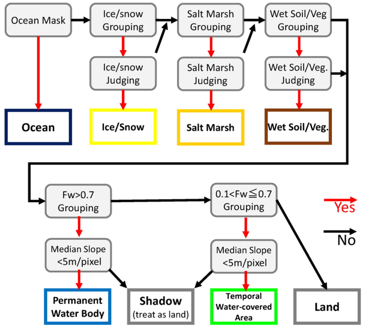

date: 2019-12-16
title: Development of a global ~90 m water body map using multi-temporal Landsat images
tags: Remote Sensing, Water, Landsat
Category: Review

**Обзор статьи
[Development of a global ~90 m water body map using multi-temporal Landsat images](https://www.sciencedirect.com/science/article/abs/pii/S0034425715301656)**

## Суть дела
Статья описывает то, как создавался продукт [Global 3 arc-second Water Body Map (G3WBM)](http://hydro.iis.u-tokyo.ac.jp/~yamadai/G3WBM/).
Этот продукт представляет собой маски постоянных и временных водных объектов, построенных на временных сериях Ландстатов (более точно -- на четырех эпохах
[Global Land Survey](https://www.usgs.gov/land-resources/nli/landsat/global-land-survey-gls?qt-science_support_page_related_con=0#qt-science_support_page_related_con)).

Маска включает следующие типы объектов:

Код|Содержание
---|----------
0  | Land
1  | Land (No Landsat observation)
10 | Snow
20 | Wet Soil / Wet Vegetation / Lava
30 | Salt Marsh
40 | Temporal Flooded Area
50 | Permanent Water
51 | Permanent Water (Added by SWBD)
99 | Ocean (Given by external land/sea mask)

## Модель

### Данные

В работе используются данные GLCF Landsat Global Land Survey [1] -- это подекадные мозаики данных Ландсат (разных поколений), очищенных от
облачности и прошедших ортокоррекцию. Авторы использовали данные TM и ETM следующих периодов: 1990, 2000, 2005 и 2010.

Используемые при расчетах каналы:

* зеленый, Green (второй);
* красный, Red (третий);
* ближний инфракрасный, NIR (четвертый);
* коротковолновый инфракрасный, SWIR (пятый);
* тепловой инфракрасный, TIR (шестой).

Помимо Ландсатов использовались данные по рельефу (главным образом SRTM, а для высоких широт и другие источники) и маски водных
объектов (в основном, океаны), полученные по радарным данным.

### Методы
#### Предварительная обработка Ландсатов

1. Взяли данные GLS.
2. Рассчитали отражательную способность и температуру для выбранных каналов $\rho_B$, $\rho_G$, $\rho_R$, $\rho_{NIR}$, $\rho_{SWIR}$ и	$T_b$ (в градусах Цельсия).
3. Рассчитали разностные индексы:
$$
NDWI = \frac{\rho_g - \rho_{SWIR}}{\rho_g + \rho_{SWIR}}
$$

$$
NDVI = \frac{\rho_{NIR} - \rho_{R}}{\rho_{NIR} + \rho_{R}}
$$

В предобработку также входит залитие "дырок" в сломанном седьмом Ландсате, которые закрыли интерполяцией (в статье описано, как именно, но нам это не суть важно).

#### Частота детекции воды
Вводится понятие частоты детекции воды ("water frequency"). Оно рассчитывется для каждого пикселя отдельно по следующей формуле:

$$
F_{w_i} = \frac{\sum_{j=1}^{N}( O_{i,j} W_{i,j} )}{\sum_{j=1}^N O_{i,j}},
$$

где $O_{i,j}$ -- надежность наблюдения в пикселе $i$ для сцены $j$,
$W_{i,j}$ -- вероятность того, что в пикселе  $i$ для сцены $j$ находится водный объект,
$N$ -- число сцен Ландсат, доступных для пикселя $i$.

Расшифровка обозначений, применяемых в данной формуле и величин, через которые они определяются, приведены в таблице:

Обозначение     |                  Формула                                        | Краткое описание
----------------|-----------------------------------------------------------------|-----------------
$O_{i,j}$       |$$O_{i,j} =  \max[1- P_{c_i}, 0.001]$$                           | надежность наблюдения в пикселе $i$ для сцены $j$
$P_{c_i}$       |$$P_{c_i} = \frac{\min[\rho_{grn}, 0.25]}{0.25}f_{NDLI}F_{T_b}$$ | вероятностный показатель того, что в пикселе $i$  сцены $j$ расположено облако или снег; лежит в диапазоне от 0 (гарантировано не облако и не снег) до 1 (гарантировано облако/снег)
$\rho_{grn}$    |$$ \rho_{grn} = \min[\rho_G, \rho_R, \rho_{NIR}]$$               | минимум отражательной способности в зеленом, красном и инфракрасном каналах
$f_{NDLI}$      |$$f_{NDLI} =\begin{cases} 1, \qquad (NDLI < 0)\\ 1-2\times NDLI, \qquad (0\leq NDLI \leq 0.5) \\ 0, \qquad (0.5 \leq NDLI )  \end{cases} $$ | корректирующий множитель на базе индекса NDLI 
$NDLI$ | $$\frac{\min[\rho_G, \rho_R] - \max[\rho_{NIR}, \rho_{SWIR}]}{\min[\rho_G, \rho_R] - \max[\rho_{NIR}, \rho_{SWIR}]}$$ | NDLI (Normalized Difference Land Index)
$f_{T_b}$       |Если (NDWI < 0.3): $$f_{T_b} =  \begin{cases} 1, \qquad (T_b < 0.25 )\\ 0.2\times(30-T_b), \qquad (25\leq T_b < 30) \\ 0, \qquad 30 < T_b )  \end{cases};$$  Если ($NDWI \geq 0.3$): $$f_{T_b} =  \begin{cases} 1, \qquad (T_b < 0 )\\ 0.2\times(5-T_b), \qquad (0 \leq T_b < 5) \\ 0, \qquad 5 < T_b )  \end{cases}$$  |  корректирующий множитель на базе теплового канала
$W_{i,j}$       |$$W_{i,j} = P_{NDWI}  f_{NDVI}$$                                | вероятность того, что в пикселе  $i$ для сцены $j$ находится водный объект
$P_{NDWI}$      |$$P_{NDWI} =  \begin{cases} 0, \qquad (NDWI < 0 )\\ NDWI/0.3, \qquad (0\leq NDWI < 0.3) \\ 1, \qquad 0.3 < NDWI )  \end{cases};$$ | вероятностный показатель, использующий NDWI
$f_{NDVI}$      |$$f_{NDDI} =\begin{cases} 1, \qquad (NDVI < 0.1)\\ 10\times (0.2 - NDVI), \qquad (0.1\leq NDVI \leq 0.2) \\ 0, \qquad (0.2 \leq NDVI )  \end{cases} $$ | корректирующий фактор, использующий NDVI 

В статье коротко описывается логика того, почему введен тот или иной корректирующий фактор, но я опускаю эти рассуждения.

#### Усреднение индексов по сценам

Помимо частоты $F_{w_i}$ в расчтетах используется усредненный индекс для отражательных способностей и вегетационных индексов. Этот параметр используется на шаге классификации водных объектов и задается следующей формулой:

$$
\overline{V}_i = \frac{\sum_{j=1}^N (O_{i,j}W_{i,j}V_{i,j})}{\sum_{j=1}^N (O_{i,j}W_{i,j})},
$$
где $\overline{V}_i$ -- усредненный индекс в пикселе $i$,  $O_{i,j}$ --надежность наблюдения в данном пикселе,  $W_{i,j}$ -- вероятность того, что в пикселе $i$ сцены $j$ находится водный объект, $V_{i,j}$ -- целевой индекс (т.е. отражательная способнобность для выбранных каналов $\rho_B$, $\rho_G$, $\rho_R$, $\rho_{NIR}$, $\rho_{SWIR}$, температура $T_b$, индексы NDWI, NDVI и $\rho_{grn}$), $N$ -- число сцен для пикселя $i$.

### Классификация
{width=90%}

Основная задача классификации -- отделить объекты, похожие на воду (лед, снег, влажные почвы, и т.д.), общая схема классификации показана на рисунке.

#### Пиксели с большими значениями NDWI

Часто большие значения NDWI оказываются у объектов, которые на самом деле не являются водой. Поэтому, чтобы отделить воду от таких объектов, предварительно проверяется ряд условий, перечисленных в таблице:

Критерий             | Лед, снег                         | Солончаки                        | Влажная почва / растительность
---------------------|-----------------------------------|----------------------------------|---------------------------------
Критерий группировки | $f_{w_i} > 0.3$                   | $f_{w_i} > 0.1$                  | $\overline{\rho}_{grn_i} < 0.15$
                     | $\overline{\rho}_{grn_i} > 0.15$  | $\overline{\rho}_{grn_i} > 0.25$ | $0.0 < \overline{WI}_i < 0.5$
                     | $\overline{T_b}_{i} <0.2$         | $\overline{T_b}_{i} > 0$         | $-0.15 < \overline{VI}_i < 0.3$
                     | $\overline{WI}_{i} > 0.4$         | $\overline{WI}_{i} > 0.4$        |
                     | $\overline{VI}_{i} > -0.2$        | $\overline{VI}_{i} > -0.2$       | 
---------------------|-----------------------------------|----------------------------------|---------------------------------
Решающий критерий    | $\overline{\rho}_{grn}^g > 0.2$   | $\overline{\rho}_{grn}^g > 0.2$  | $ \overline{WI}^g < 0.5$
                     | $\overline{Tb}^{g} <0$            |                                  | $\overline{VI}^g < 0.05$
                     | $\overline{WI}^{g} >0.6$          |                                  | 
                     | $\overline{VI}^{g} >0.2$          |                                  |

(Авторы пишут, что пороги, представленные в таблице получены опытным путем.)

В таблице описаны два класса критериев:

* критерий группировки, он отвечает за то, чтобы объединить близлижайшие пиксели в одну "лепешку" (группу); это позволяет избежать излишнего мельчения участков, т.е. пиксели,
  лежащие в одной группе будут отнесены к общему классу; для всех пикслей группы расчитывается групповой индекс, полученный на базе усредненного по сценам индекса ($\overline{V}^g = \frac{\sum_{i=1}^M \overline{V}_i}{M}$, где $M$ -- число пикселей в группе).
* решающий критерий отвечает за то, к какому классу следует отнести выделенную группу.

Таким образом работа происходит в несколько этапов: выделение групп, затем рассчет групповых индексов и принятие решения о том, следует ли отнести группу к тому или иному классу или же передать эти пиксели на дальнейшую обработку.

#### Выделение водных поверхностей
После исключения из анализа льда, солончаков и влажных почв оставшиеся пиксели классифицируются как "временно заливаемые территории", "постоянные водные объекты" и "суша". На этом этапе наибольшую
трудность представляют тени, которые по своим свойствам перемешиваются с водной поверхностью => жизнь облегчит использование ЦМР, которая позволяет отфильтровать тени на склонах. Поэтому:

 * группируются пиксели, для которых $f_{w_i} > 0.7$, если для более чем половины из них перепад высот составляет менее 5 метров на пиксель (у авторов пиксель 90 метров), то эта группа считается постоянным водным объектом, в противном случае -- тенью;
 * группируются пиксели, для которых $0.1 \leq f_{w_i} \leq 0.7$, эта группа считается временно заливаемой территорией, если для нее групповой NDWI не менее 0.5 и перепад высот для половины пикселей группы не выше 5 метров на пиксель.

Все оставшиеся пиксели считаются сушей.

## Замечания

Изначальная статья разрабатывалась на долговременных рядах данных (пара десятков лет), подход будет работать плохо для изменяющихся во времени русел (и авторы подключают дополнительные источники на этот случай). Но нас это не слишком пугает -- у нас глубин анализа два-три года.

Авторы подбирали параметры и пороги итеративно визуальным контролем. Вполне возможно, что на нашу территорию нужно будет использовать другие значения параметров.

# Литература
[1] Gutman, G., Huang, C., Chander, G., Noojipady, P., & Masek, J. G. (2013). Assessment of the
NASA-USGS Global Land Survey (GLS) datasets. Remote Sensing of Environment, 134,
249–265. http://dx.doi.org/10.1016/j.rse.2013.02.026.

