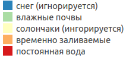
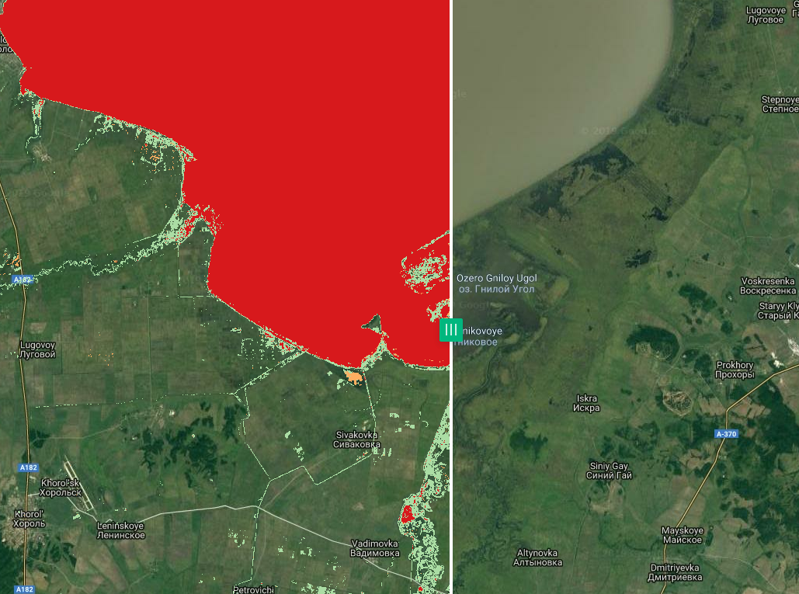
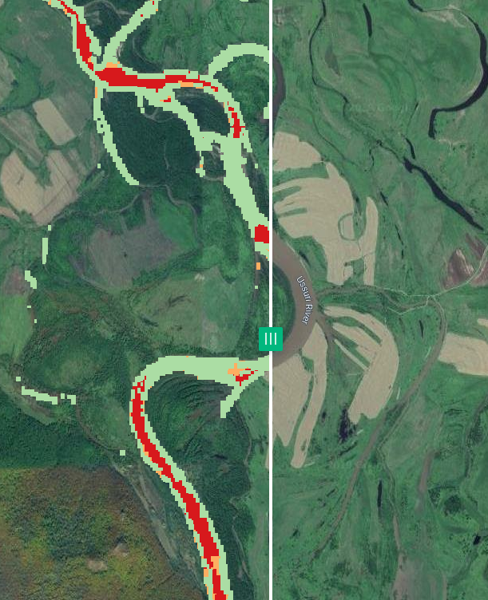
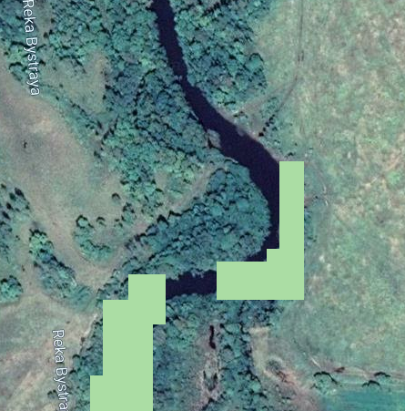

date: 2019-12-25
title:  Реализация методики из статьи "Development of a global ~90 m water body map..." на базе Sentinel-2
tags: Sentinel-2, Remote Sensing, GEE, Water
Category: GEE

# Задача

Ранее описывалась [методика поиска водных объектов]({filename}/2019-12-16-Water.md), разработанная для Landsat. Она
позволяет строить карты постоянных водных объектов, временно затапливаемых территорий, а также похожих на них по своим спектральным свойствам участков (лед, солончаки, и т.п.).
Ниже рассматривается реализация "в лоб", выполненная в GEE на базе Sentinel-2.

# Сложности

Исходная методика была сделана на базе данных Landsat-7 (и более ранних КА), разрешение результирующего слоя - 90 метров. При переходе на Sentinel возникают следующие трудности:

 - в исходной методике использовался не "сырой" Landsat, а подготовленные композиты, которых для Сентинеля просто нет; но если посмотреть статью, то видно, что
   особой необходимости в использованиии именно композитов нет, это был, скорее, вопрос удобства или вычислительных мощностей (статья описывает глобальный подход, там требования к
   железу велики);
 - более сложно то, что статья активно использует тепловой канал, которого у Сентинеля по просту нет; пришлось выкручиваться тем, что при работе на каждый анализируемый момент времени
   были созданы два композита -- Сентинель и, за тот же период, Ландсат; к каналам Сентинеля был приклеен тепловой канал с Ландсата, затем дальнейшая работа пошла по исходной методике;
   также возникли сложности с тем, что у нас в работе использовался восьмой Ландсат, у которого два тепловых канала (причем оба в сумме будут короче соответствующего канала 7-го Ландсата);
 - коэффициенты и пороги, описанные в статье, подбирались авторами на глаз, создавались для глобального продукта и на Ландсатах; в нашем случае продукт региональный и на Сентинеле; таким образом выходит, что
   эти параметры нужно подбирать под наши условия, и это отдельная история.

Тем не менее, сделав скидку на эти отличия, методика в первом приближении была реализована, и можно смотреть первые результаты.

# Реализация

* Для удобства использования все константы, описанные в статье, вынесены в отдельный модуль Yamazaki/constants, [текущая версия](https://code.earthengine.google.com/6283a5042b243b041c3cce78eeb1b1bb).
* Предобработка данных в общих чертах следует той, что  [была описана ранее]({filename}/2019-12-13-GEE.md), основные функции вынесены в отдельный модуль Preprocess, [текущая версия](https://code.earthengine.google.com/1373113556075e0857ec0c37c6b4f28c).
* Основные растры, используемые в работе, генерируются отдельным скриптом и сохраняются в ASSETS, это позволяет использовать закэшированные данные, что ускоряет процесс анализа на последних этапах. В то же время такой подход не позволяет на лету менять те параметры, от которых зависят созданные растры: при изменении этих параметров требуется перегенерировать "кэш". Скрипт называется Yamazaki/createFactors, [текущаяя версия](https://code.earthengine.google.com/9d86acaa489cc125e8f1644c34c7a88b). Вместо эпох, использованных в исходной статье здесь были сгенерированы помесячные композиты (для Сентинелей - все требуемые методикой каналы, для Ландсатов - TIR2 за тот же период); использовались летние данные за последние два года, получилось 12 композитов.
* Функции, описанные в статье вынесены в модуль Yamazaki/functions, [текущая версия](https://code.earthengine.google.com/e6d8d1e1cd98e5ff99bb58667d68c9e9).
* Правила классификации (групповые и решающие), а также сами процедуры классификации хранятся в модуле Yamazaki/classifier, [текущая версия](https://code.earthengine.google.com/d77690c54a571c61860bce1e671e6cc1). Данный модуль также экспортирует на диск результат классификации.

# Результаты
В целом результаты приемлемые (с учетом того, что это первый пробный шар, и у нас есть множество вариантов улучшения качества): вода в целом выделена, хотя и не без ошибок. Наиболее частые ошибки -- отнесение ручьев и небольших рек к временно заливаемой территории (а также пропуски таких участков). Иногда также водная поверхность была отнесена к влажной почве. Многие из этих ошибок могут быть исправлены за счет настройки пороговых значений классификатора.
Как и ожидалось, ни снежных участков (т.к. использовались данные за летний период), ни солончаков на нашей территории не обнаружилось. Довольно много было помечено влажных почв/сырой растительности.

## Примеры

На рисунках приводятся примеры отмеченных ситуаций. Интерактивный вариант карты можно посмотреть в [NextGIS Web](https://kolesov.nextgis.com/resource/1981/display?panel=layers).

### Легенда

### Южная часть озера Ханка
На снимке показана южная часть озера Ханка (со шторкой, чтобы была частично видна подложка), на рисунке видно, что озеро было помечено верно.

### Реки
Река Уссури на значительном протяжении была помечена как временно заливаемая территория (а местами и вообще, как влажная почва).

Мелкие реки могут быть вообще не распознаны как водные объекты, например, река Быстрая (ширина реки в данном месте около 15-ти метров).

## Причины ошибок

Причин ошибок, нужно думать, довольно много, но вот те, что бросаются в глаза:

* не оптимально выставлены параметры алгоритма; например, если использовать параметр отнесения пикселя к постоянному водному объекту $f_{w_i}>0.7$ (как рекомендуется в статье),
  то на рассматриваемой территории воды почти не будет найдено;
* учет рельефа: в исходной статье использовалось правило, что если перепад высот на участке будет превышать 5 метров на пиксель (у них пиксель 90 метров), то это - теневой склон; в нашем
  случае такое правило (с поправкой на размер нашего пикселя) приводит к тому, что часть водных объектов отбраковывается (см. пример выше с реками); возможно, это связано с
  тем, что используемый рельеф (SRTM) слишком груб для нашего разрешения.

# Дальнейшие действия

Первым делом нужно будет заняться подбором параметров алгоритмов, далее будем действовать по результатам. Как минимум уже сейчас полученный классификатор можно использовать как
вспомогательное средство для создания обучающих примеров для более сложных алгоритмов.
