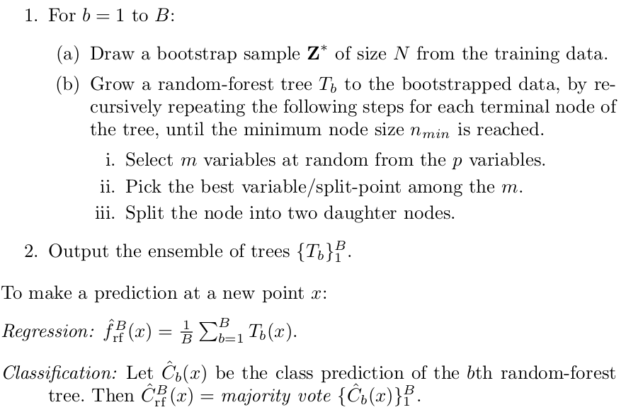

date: 2020-01-18
title:  Подбор параметров моделей для GEE
tags: Remote Sensing, GEE
Category: Google EarthEngine tools

Google EarthEngine позволяет быстро строить модели для обработки данных ДЗЗ, но в текущей версии GEE нет каких-либо
функций, которые обеспечвают поиск оптимальных параметров моделей. Возможно, они появятся позднее (GEE очень быстро
развивается), но сейчас приходится выкручиваться самостоятельно.

Пока самый простой в реализации способ из обнаруженных -- подбор параметров внешним скриптом. Общая идея такова:

 * пишется модель на Python API, которая выполняет нужные нам действия;
 * модель оборачивается в функцию, которая принимает на вход параметры модели или в отдельный скрипт,
   который принимает параметры из командной строки и затем вызвается из нее;
 * строится цикл, состоящий из процедур обучения модели и проверки качества ее работы; в этом цикле по той
   или иной схеме перебираются параметры модели; самый простой вариант -- поиск параметров на решетке, но
   можно и заморочиться тем, что скрипт закидывается в специальный софт для оптимизации.


Ниже на примере подбора параметров случайного леса.

# Предварительные действия

Необходимо сначала:

* установить Python API, процедура хорошо описана в [официальной документации](https://developers.google.com/earth-engine/python_install), нет смысла повторяться;
* получить ключ доступа к движку GEE, выполнив из командной строки:
```{bash}
earthengine authenticate
```
  появится поле ввода и ссылка, по которой нужно перейти, а затем ввести ключ в поле ввода;

* в любом скрипте, в котором будет происходить работа с GEE нужно будет перед началом всех действий инициализировать GEE; простейший пример:
```
import ee

# Initialize the Earth Engine module.
ee.Initialize()

# Print metadata for a DEM dataset.
print(ee.Image('USGS/SRTMGL1_003').getInfo())
```

# Подбор параметров модели

Готовый к использованию код лежит в [репозитории](https://gitlab.com/nextgis_private/gee_ural/tree/master/scripts). Ниже описываются
лишь основные моменты, необходимые для понимания, а в исходном коде из репозитория есть детали, не влияющие на прицнип, но внесенные
в код из практических соображений использования.

Вся система состоит из двух файлов:

 * trainner.py: файл-обертка над функциями обучения, содержит процедуру подбора параметров, оформлено все в виде утилиты командной строки;
 * utils.py: файл содержит основные функции (описание моделей, расчет точности и т.п.).


## Модель и оценка точности

Данные функции определяются в файле utils.py


### Описание классификатора
Алгоритм случайного леса строит $B$ деревьев, каждое из которых в классическом варианте конструируются по следующей схеме:

{width=70%}


Модель случайного леса, используемая в GEE содержит следующие настраиваемые параметры:

* numberOfTrees: число деревьев, используемых при построении леса (величина $B$ в обозначениях алгоритма);
* variablesperSplit: число переменных, участвующих в разбиении пространства признаков при построении леса (величина $m$ в обозначениях алгоритма);
* minLeafPopulation: разбиение прекращается при достижении данного числа объектов в узле дерева (величина $n_{min}$);
* bagFraction: доля примеров, используемых при построении дерева, по отношению к общему числу имеющихся примеров;
* outOfBagMode: использовать ли при построении леса режим "out of bag"; при этом режиме точность классификатора на примере номер $i$ оценивается только по тем
  деревьям, в обучении которых данный пример не учавствовал; режим позволяет одновременно обучать и производить перекрестную проверку обучения (дает
  возможность не переобучаться, но за счет значительного замедления процедуры обучения);
* seed: настройка датчика случайных чисел.

Собственно сама функция, обеспечивающая построения классификатора выглядит следующим образом:

```{python}
def train(numberOfTrees, variablesPerSplit, minLeafPopulation, bagFraction, outOfBagMode, seed, collection, classname, names):
  classifier = ee.Classifier.randomForest(
    numberOfTrees=numberOfTrees,
    variablesPerSplit=variablesPerSplit,
    minLeafPopulation=minLeafPopulation,
    bagFraction=bagFraction,
    outOfBagMode=outOfBagMode,
    seed=seed
  ).train(collection, classname, names)
  return classifier
```

Она принимает на вход

* параметры классификатора,
* коллекцию обучающих примеров (collection),
* название поля, содержащего метку класса (classname),
* список полей (числовых), которые будут использоваться при обучении (names).

Результатом работы функции является обученный классификатор.


### Оценка точности классификатора
Точность можно оценивать различными способами, в данном примере показано, как можно
оценить точность и величину Kappa на обучающем и тестовом множествах.

```{python}
def getQuality(classifier, testCollection, classname):
  trainAccuracyMatr = classifier.confusionMatrix();
  trainAcc = trainAccuracyMatr.accuracy();
  trainKappa = trainAccuracyMatr.kappa();

  testAnswers = testCollection.classify(classifier);
  testAccuracyMatr = testAnswers.errorMatrix(classname, 'classification');
  testAcc = testAccuracyMatr.accuracy();
  testKappa = testAccuracyMatr.kappa();

  return dict(trainAcc=trainAcc, trainKappa=trainKappa, testAcc=testAcc, testKappa=testKappa, testErrMatr=testAccuracyMatr)

```

Функция берет на вход обученный классификатор и тестовое множество, а возвращает словарь значений:

* trainAcc: точность на обучающем множестве,
* trainKappa: Kappa на тестовом множестве,
* testAcc: точность на тестовом множестве,
* testKappa: Kappa на тестовом множестве,
* testErrMatr: матрица ошибок на тестовом множестве.

В этой функции жестко прописано название поля, содержащего результаты классификации "classification".
По-хорошему его нужно вынести в параметры функции, но это название генерируется автоматически самим классификатором
и оно оставлено, чтобы не слишком заморачиваться с числом пробрасываемых сквозь функции параметров.


### Обучение и оценка
Объединение описанных выше шагов в одну функцию для удбства работы:

```{python}
def testCase(image, trainCollection, testCollection, classname, names, params, seed=0):
  classifier = train(
    numberOfTrees=params['numberOfTrees'],
    variablesPerSplit=params['variablesPerSplit'],
    minLeafPopulation=params['minLeafPopulation'],
    bagFraction=params['bagFraction'],
    outOfBagMode=params['outOfBagMode'],
    seed=seed,
    collection=trainCollection, classname=classname, names=names
  )
  classified = image.classify(classifier)
  qual = getQuality(classifier, testCollection, 'Class')
  test, val = qual['trainKappa'].getInfo(), qual['testKappa'].getInfo()

  return test, val
```
Функция обучает классикатор на заданных параметрах, которые передаются в виде словаря значений, и возвращает два числа -- Kappa на тестовом и обучающем множествах.

В этой функции жестко прописано название поля с меткой класса ("Class"), по-хорошему, нужно вынести его в параметры функции.
(Но оставлено по принципу "и так сойдет")


## Подбор параметров

Подбор параметров был сделан в отдельном скрипте, оформленном в виде утилиты командной строки.

Основой скрипта является функция main, которая производит в цикле процедуру перебора параметров и
оценки точности классификаторов для этих параметров на обучающем и тестовом множествах.

### Функция подбора параметров

Функция принимает на вход следующие параметры:

* название векторного слоя обучающего множества примеров;
* название векторного слоя тестового множества;
* название растра, который требуется классифицировать; каналы растра -- признаки, использующиеся
  при классификации;
* название файла формата CSV, в который будут писаться результаты (параметры и точность, достигнутая
  на этих параметрах);

В этой функции жестко прописано название поля с меткой класса ("Class"), по-хорошему, нужно вынести его в параметры функции.
(Но оставлено по принципу "и так сойдет"). Поле 'system:index' генерируется автоматически GEE и не несет никакой смысловой
нагрузки, поэтому удаляется сразу же.

Вообще в этой функции много жестко зашитых параметров (число проверямых деревьев, число листьев и т.п.), но
этот скрипт используется в экспериментов, поэтому все эти параметры правятся по необходимости и под каждую задачу.
Поэтому (ИМХО) нет большого смысла их параметризовывать и выносить их вовне.

Функция пробегает по решетке параметров и для каждого набора строит классификатор, а затем оценивает его точность.
При необходимости можно перестроить шаг по каждому из параметров.

Важно отметить, что тут во всех классификаторах используется параметр `outOfBagMode=False`, это позволяет ускорить
процесс работы (хотя и повысить шансы на переобучение).

Кроме того, в случае, когда используется большое число каналов в растре и строится сложный классификатор (число деревьев, листьев),
то может возникнуть ошибка таймаута GEE. В этом случае возникает ошибка `ee.EEException`, которая отлавливается и игнорируется (с
записью в лог соотвествующего сообщения).

```{python}
def main(landTrain, landVal, dataSetName, resultCSV, verbose=False):
    # Список полей, используемых для обучения:
    NAMES = landTrain.first().propertyNames().remove('system:index').remove('Class')
    count = len(NAMES.getInfo())

    image = ee.Image(dataSetName);

    # Собираем список из количества переменных, для которых будут строиться классификаторы
    variable_counts = set([int(n) for n in [math.sqrt(count), math.sqrt(count)/2, math.sqrt(count)*2]]) - set([0, 1, 2])
    variable_counts = list(variable_counts)
    variable_counts.sort()


    with open(resultCSV, 'w') as csvfile:
        writer = csv.writer(csvfile, delimiter=',')
        data = ['trainKappa', 'valKappa', 'numberOfTrees', 'variablesperSplit', 'minLeafPopulation', 'bagFraction']
        writer.writerow(data)

        for numberOfTrees in [10, 100, 300, 500]:
          for variablesPerSplit in variable_counts:
            for minLeafPopulation in [10, 50, 300]:
              for bagFraction in [0.3, 0.5, 0.7]:
                params = dict(
                  numberOfTrees=numberOfTrees,
                  variablesPerSplit=variablesPerSplit,
                  minLeafPopulation=minLeafPopulation,
                  bagFraction=bagFraction,
                  outOfBagMode=False
                )
                try:
                    trainKappa, valKappa = testCase(image, landTrain, landVal, 'Class', NAMES, params)
                    data = [trainKappa, valKappa, params['numberOfTrees'], params['variablesPerSplit'], params['minLeafPopulation'], params['bagFraction']]
                    if verbose:
                        logging.info(data)
                    writer.writerow([str(x) for x in data])
                except ee.EEException:
                    logging.error('En error occurs for %s params for %s dataset' % (params, dataSetName))
```

### Итоговый скрипт и его использование
Собственно весь скрипт представляет собой обертку над функцией main: основная часть скрипта -- это анализ параметров командной строки (входные слои, выходной файл).
Детали реализации скрипта можно посмотреть в репозитории.

А использование скрипта выглядит примерно так:

```{bash}
python trainner.py \
       --train "users/kolesovdm/Steppe/set13Train" \
       --val "users/kolesovdm/Steppe/set13Val" \
       --image "users/kolesovdm/Steppe/dataSet13" \
       --result "set13.csv"
```
где train -- векторный слой обучающих примеров, val -- векторный слой тестовых примеров, image -- изображение для классификации, result -- куда сохранить параметры и точность, достигаемую на них.