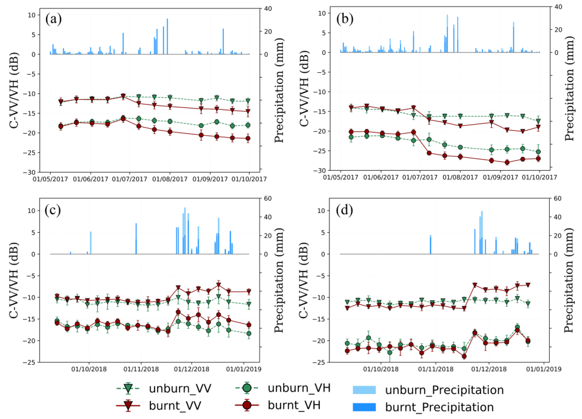
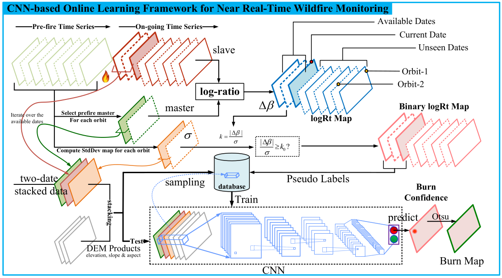

date: 2020-02-10
title: Near Real-Time Wildfire Progression Monitoring with Sentinel-1 SAR Time Series and Deep Learning
tags: Monitoring, Change Detection, Fire, Sentinel-1
Category: Review

**Обзор основных методов статьи 
[Y. Ban, P. Zhang, A. Nascetti, A. R. Bevington, and M. A. Wulder, “Near Real-Time Wildfire Progression Monitoring with Sentinel-1 SAR Time Series and Deep Learning”](https://www.nature.com/articles/s41598-019-56967-x.pdf)**

## О чем пойдет речь

Статья описывает методы мониторинга пожаров в режиме, близком к режиму реального времени на данных Сентинель-1. Радарная съемка позволяет
мониторить территории не взирая на облачность и дымы (особенно актуально при мониторинге пожаров).

Авторы используют сверточные сети и применяют их к анализу свежих изображений, полученных с Сентинель-1, и исторических данными Сентинелей (необходимых
для оценки вариативности отраженного сигнала).

Нас эта работа интересует как способ "подсмотреть" методы мониторинга и применить их к мониторингу лесоизменений в целом, а не только пожаров.

## Исходные данные и результаты

Используется Sentinel-1, были построены временные ряды для поляризаций VV и HV, полученные в режиме IW. Территория, на которой производились работы, -
нескольк площадей в США и Канаде. Оценка работы алгоритмов мониторинга производилась:

 * на базе снимков сверхвысокого разрешения Worldview-3;
 * снимков Sentinel-2;
 * полевых работ.

Для анализа выбирались несколько областей интереса, расположенных на лесных и не-лесных территориях и различных попографических условиях (высота, склоны и т.п.).
По этим участкам собиралась статистика того, в каких дипазонах изменяется отраженный сигнал (средние, дисперсии), строились временные ряды сигналов до и после пожаров.
Поскольку данные радарной съемки зависят от важности почвы и насыщенности растений влагой, то собиралась также информация о суточных атмосферных осадках. На рисунке показаны
примеры временных рядов для сгоревших и не-сгоревших лесных (графики (a) и (c)) и травянистых участков (графики (b) и (d)).

{width=95%}

Далее авторы приводят куски снимков, показывающих ход распространения пожаров и результаты классификации (пожар/не-пожар) полученные различными методами, начиная с простейших, и
заканчивая сверточной сетью (logRt, kmap, CNN_*). Также приводится сводная таблица по качеству классификации, из которой видно, что по метрикам $F_1$ и Kappa сверточная сеть показывает наилучшие результаты.

## Описание методики

Общая схема: как только приходит сигнал о пожаре, из архивной съемки поднимаются имеющиеся данные и составляются статистики по тому,
как ведет себя отраженный сигнал в "естественных" условиях, т.е. до пожара. Затем производится мониторинг распространения пожара на базе
сравнения вновь полученных сигналов и исторической съемки.

Более детально:

 * рассчитывается логарифм отношения изображений, полученных до пожара и после пожара;
 * строится грубая бинарная маска сгоревших и не-сгоревших участков, для этого используются методы поиска аномалий во временных рядах;
 * полученная маска используется в качестве обучающего множества для сверточной сети; сеть возвращает растры, описывающие "уверенность" сети
 в том, что пожар был;
 * на последнем шаге строятся бинарные растры пожар/не-пожар на базе сравнения "уверенности" с автоматически вычисляемым порогом.

Эта методикаа показана на следующем рисунке и подробно описывается ниже:

{width=95%}

### Логарифм отношения
Выбирается снимок, предшествующий пожару: должен быть таким, чтобы эффекты сезонности были сведены к минимуму и в то же время это не должен быть снимок, полученный после сильного дождя.

Затем для каждого снимка, полученного после начала пожара строится временной ряд логоарифма отношений:

$$
\Delta \beta_r = 10 \log_{10} \left ( \frac{\beta_r^m}{\beta_r^s} \right ),
$$
где $r\in ASC_{-\mu}, DSC_{-\mu}$ - индекс снимка, обозначает восходяющую или нисходящую орбиту и его относительный номер ($\mu$ $\nu$), $m$ -- базовый снимок,
полученный до начала пожара, с которым производится сравнение, а $s$ -- снимок полученный после начала пожара. Таким образом получаем временной ряд растров. Аналогичный временной
ряд строится на основе сравнения базового снимка $m$ и снимков, полученных до начала пожара; этот временной ряд позволяет оценить вариативность данных в "нормальных" условиях.

Далее для сокращения записи используется простое обозначение $\Delta \beta$ вместо $\Delta \beta_r$.

### Поиск аномалий
Основываясь на временном ряду снимков, предшествующих пожару, оценивается среднее и стандартное отклонение для логарифма отношений (в каждом пикселе свои статистики).
Эти статистики вычисляются по всей области интересов отдельно для восходящей и нисходящей орбиты и поляризаций VH и VV:

$$
\sigma(i,j)  = \sqrt{\frac{\Sigma_{t=1}^N (\beta^t(i,j) - \overline{\beta}(i,j))^2}{N-1}},
$$
где $\overline{\beta}(i,j)$ - средний логарифм отношений в пикселе $(i,j)$, $N$ -- число доступных сцен для анализируемой орбиты и поляризации.

Далее расчитывается величина kmap:

$$
I_k(i,j) = \frac{|\Delta \beta(i,j)|}{\sigma(i.j)},
$$
эта величина оценивает "неожиданность" соответствующего $|\Delta \beta(i,j)|$ -- чем она выше, тем более аномальным предтавляется отношение логарифмов.
Пиксель относится к аномальным по превышении некоторого порога:

$$
I(i,j) =\begin{cases} 1, \qquad I_k(i,j) \geq k_0 \\ 0, \qquad I_k(i,j) < k_0  \end{cases},
$$
авторы рекомендуют начать с $k_0 = 2$.

Полученный временной ряд бинарных масок является входном для следующего шага.

### Сверточная сеть

Полученные на предыдущем этапе грубые оценки сгоревших участков используются для автоматического построения обучающего множества.

Пробегая по всем доступным датам конструируется стек изображений из следуюих слоев:

* базовый снимок;
* текущий снимок;
* растр $\sigma(i,j)$;
* данные по рельефу -- высоты, крутизна и экспозиция склонов.

Случайным образом генерируются одинаковое число примеров сгоревших и не сгоревших участков. Бинарная маска аномалий, рассчитанная на предыдущем этапе,
является маркером того, считать участок сгоревшим или нет.

Далее обучается сверточная сеть, которая должна помечать сгоревшие области. Авторы описывают архитектуру своей сверточной сети без особых подробностей, но
похоже, что это "ванильная" нейросеть: она настроена на классификацию, а не сегментацию (возвращает сгорело/не-сгорело для центрального пикселя участка из 55х55 пикселей).

Но поскольку на выходе сети у авторов стоит сигмоидальная функция, то выходная величина -- не бинарная, а непрерывная. Полученный растр со значениями из диапазона (0, 1) авторы
называют растром "уверенности" (confidence map).

Опционально авторы предлагают использовать результаты обученной сети после первой итерации обучения для того, чтобы уточнить маску пожаров и на основе уточненной маски генерируются дополнительные обучающие примеры.

### Построение бинарной маски и аггрегация временных рядов
Из нейросети выходит непрерывная величина, лежащая в диапазоне (0, 1). Авторы предлагают бинаризовать ее согласно процедуре выбора порога бинаризации Otsu [Otsu, N. A threshold selection method from gray-level histograms. IEEE Trans. Syst. Man, Cybern. 9, 62–66, https://doi.org/10.1109/ TSMC.1979.4310076 (1979).]. *Признаться, я не знаю, что то за процедура, а авторы ее не описывают -- нужно будет заглянуть в первоисточник.*

Для того, чтобы построить куммулятивную маску пожаров авторы предлагают использовать два метода:

* быстрый способ состоит в том, чтобы объединить между собой все предыдущие маски;
* второй способ состоит из процедуры постобработки и использует созданные на текущий момент маски, согласно этому методу
  временной ряд масок обрабатывается гаусовым фильтром во временной области; (*не совсем понятно -- гаусов фильтр выдаст опять-таки непрерывную величину, которую снова нужно будет бинаризовать... в чем выгода?*)

