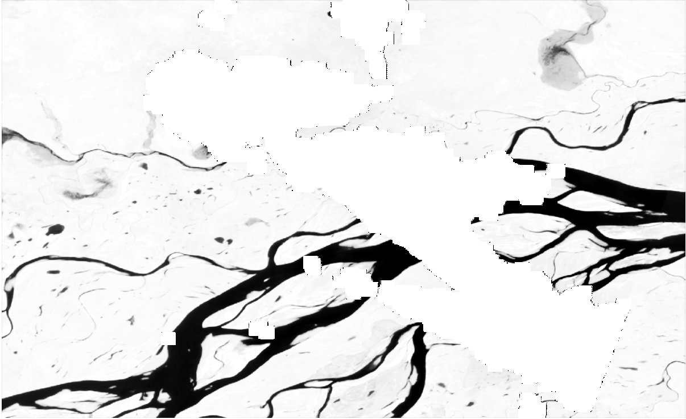

date: 2020-04-11
title: Ппример процедуры сегментации космосьемки сверточной сетью
tags: Water
Category: NeuralNets

Цель создания этого документа -- описать полную цепочку сегментации космоснимков от генерирования обучающих примеров и обучения нейросети до использования полученной сети.
В качестве демонстрационого примера выбрана задача поиска водных объектов, в качестве используемой сети -- UNet.

Для примера исходных данных, с которыми будем работать, возмем подготовленные ранее медианные композиты Сентинель-2, искать на них будем маску водных объектов.
Наша задача -- восстановить маску при помощи нейросети.

Работа будет строиться по следующей схеме:

1. Создание обучающей выборки.
2. Построение нейросети.
3. Обучение нейросети.
4. Использование обученной сети.


# Построение обучающей выборки
Для обучения сети нам потребуются примеры входных снимков и известных ответов. 

Обучающие данные сгенерируем в GRASS GIS и выгрузим в виде набора отдельных файлов формата GeoTIFF. Предполагается, что данные Сентинель-2 и маска водных объектов
уже загружена в БД GRASS. В реальной жизни у нас не будет готовой маски, а будут лишь отдельные отрисованные примеры. Чтобы имитировать этот случай сгенерируем
несколько случайных точек, а затем вырежем из космоснимков участки вокруг точек. Полученные участки будем использовать как обучающие.

Проведем подготовительную работу: сгенерируем точки, объединим отдельные каналы снимков в одну группу:
```{bash}
GRASS> v.random out=pts np=5000 restrict=AOI
GRASS> v.db.addtable pts col="land int"
GRASS> v.what.rast pts rast=water col=land

GRASS> i.group group=may18 input="may18.green,may18.ndli,may18.ndvi,may18.ndwi,may18.nir,may18.red,may18.swir,may18.tir"
```

Построим вокруг каждой точки буфер размеров в 32 пикселя и экспортируем данные в виде отдельного изображения в формате GeoTIFF.
Отметим, что число пикселей в тайле (32) взято для примера, и можно использовать другие варианты. Более того, далее мы создадим нейросеть, которая может
обучаться на различных размерах тайлов.

        
```{python}
PythonGRASS> gscript.run_command('g.region', raster='may18.green')
PythonGRASS> region = gscript.parse_command('g.region', flags='g')
PythonGRASS> resolution = region['ewres']

PythonGRASS> PIXELS = 16
PythonGRASS> DELTA = PIXELS * float(resolution)

PythonGRASS> points = gscript.read_command('v.out.ascii', input='pts')
PythonGRASS> for p in points.split():
    lon, lat, cat = p.split('|')
    lon, lat = float(lon), float(lat)
    n, s = lat + DELTA, lat - DELTA
    w, e = lon - DELTA, lon + DELTA
    gscript.run_command('g.region', n=n, s=s, e=e, w=w, flags='p')
    outname = 'may_18_' + cat + '.tif'
    water_name = 'water_' + cat + '.tif'
    gscript.run_command('r.out.gdal', input='may18', output=outname, flags='cm')
    gscript.run_command('r.out.gdal', input='water', output=water_name, flags='cm')
```

Данный код генерирует 5000 тайлов на базе снимка Сентинель-2 и маски воды, которые называются may_18_NUM.tif и water_NUM.tif соответвенно.

# Создание нейросети

Создадим нейросеть воспользовавшись фреймворком TensorFlow. В качестве примера создадим Unet, состоящую всего из пары слоев в каждом направлении (кодировщика и декодировщика).

Поскольку у нас маска воды состоит из двух классов (вода/не-вода), то можно рассматривать задачу как задачу регрессии, а не классификации. Поэтому при создании
сети на выходной слой поставим функцию активации "гиперболический тангенс", которая ограничивает выход сети в диапазоне от -1 до 1, а для 
функции потерь возьмем обычную среднеквадратичную разаность.

```{python}
import tensorflow as tf
import numpy as np

from tensorflow.python.keras import layers
from tensorflow.python.keras import losses
from tensorflow.python.keras import models
from tensorflow.python.keras import metrics
from tensorflow.python.keras import optimizers


def conv_block(input_tensor, num_filters):
    encoder = layers.Conv2D(num_filters, (3, 3), padding='same')(input_tensor)
    encoder = layers.BatchNormalization()(encoder)
    encoder = layers.Activation('relu')(encoder)
    encoder = layers.Conv2D(num_filters, (3, 3), padding='same')(encoder)
    encoder = layers.BatchNormalization()(encoder)
    encoder = layers.Activation('relu')(encoder)
    return encoder

def encoder_block(input_tensor, num_filters):
    encoder = conv_block(input_tensor, num_filters)
    encoder_pool = layers.MaxPooling2D((2, 2), strides=(2, 2))(encoder)
    return encoder_pool, encoder

def decoder_block(input_tensor, concat_tensor, num_filters):
    decoder = layers.Conv2DTranspose(num_filters, (2, 2), strides=(2, 2), padding='same')(input_tensor)
    decoder = layers.concatenate([concat_tensor, decoder], axis=-1)
    decoder = layers.BatchNormalization()(decoder)
    decoder = layers.Activation('relu')(decoder)
    decoder = layers.Conv2D(num_filters, (3, 3), padding='same')(decoder)
    decoder = layers.BatchNormalization()(decoder)
    decoder = layers.Activation('relu')(decoder)
    decoder = layers.Conv2D(num_filters, (3, 3), padding='same')(decoder)
    decoder = layers.BatchNormalization()(decoder)
    decoder = layers.Activation('relu')(decoder)
    return decoder


def get_model(band_count=8, loss='MeanSquaredError', show_metrics=['RootMeanSquaredError']):
    inputs = layers.Input(shape=[None, None, band_count]) # 32x32
    encoder0_pool, encoder0 = encoder_block(inputs, 32) # 16x16
    encoder1_pool, encoder1 = encoder_block(encoder0_pool, 64) # 8x8
    center = conv_block(encoder1_pool, 128) # center
    decoder1 = decoder_block(center, encoder1, 64) # 16
    decoder0 = decoder_block(decoder1, encoder0, 32) # 32
    outputs = layers.Conv2D(1, (1, 1), activation='tanh')(decoder0)

    model = models.Model(inputs=[inputs], outputs=[outputs])

    opt = tf.keras.optimizers.SGD(learning_rate=0.0001)

    model.compile(
        optimizer=opt, # optimizers.get(optimizer), 
        loss=losses.get(loss),
        metrics=[metrics.get(m) for m in show_metrics])

    return model

```

Основная функция здесь  -- get_model, она принимает на вход набор параметров сети (основной - число каналов снимка) и параметры оптимизатора.
Внутри функции стоит обратить внимание на первую строку
```{python}
    inputs = layers.Input(shape=[None, None, band_count]) # 32x32
```
Эта строка задает размерность входного изображения. С одной стороны мы генерировали тайлы размером 32x32 пикселя и можно было бы прописать
размеры этих тайлов в параметре shape, но нас интересует обработка больших по объему снимков, поэтому мы не будем указывать размерность входных
данных, что позволит нам при использовании сети подавать на вход другие размеры снимков.

Это иллюстративный пример, тем не менее данную функцию легко модифицировать под свою задачу, например, можно изменить число слоев или задать иные метрики.

# Обучение сети

Для обучения сети прочитаем сгенерированные тайлы и запустим процесс настройки параметров:

```{python}
def get_sample_image(num):
    x = tiff.imread('may_18_%s.tif' % (num, ))
    x = np.nan_to_num(x)   
    x[:, :, 7] /= 30      # "Нормализация"
    y = tiff.imread('water_%s.tif' % (num, )) - 1.0
    y = np.nan_to_num(y)
    return (x, y)


def get_data(num):
    x = []
    y = []
    for i in range(1, num):
        x0, y0 = get_sample_image(i)
        x.append(x0)
        y.append(y0)
    return np.array(x), np.array(y)

x, y = get_data(5000)

m = get_model()
m.fit(x=x, y=y, epochs=100, validation_split=0.67)

m.save('saved_model/model_100')

```

Здесь функция get_sample_image считывает обучающую пару изображений под номером num, а функция get_data генерирует обучающее множество целиком.
В функции чтения данных нужно обратить внимание на следующую пару строк:
 
 - первая строка x = np.nan_to_num(x) производит замену всех NaN на нули: дело
в том, что в реальных снимках часть пикселей на изображении может отсуствовать и лучше обработать этот вариант заранее, заменив такие пиксели.
 - второе замечание касается нормализации данных: x[:, :, 7] /= 30 Эта строка специфична для конкретного набора данных: все каналы используемого нами изображения
лежат в диапазоне от -1 до 1, но последний канал хранит температуру, которая может изменяться в более широких пределах. 
Поэтому и производится деление на 30 градусов, чтобы все каналы были приблизительно одинаковы по своему размаху.


Собственно обучение производится одной строкой:
```{python}
m.fit(x=x, y=y, epochs=100, validation_split=0.67)
```
При этом происходит разбиение обучающего множетва на две части - рабочее, на котором происходит собственно обучение, и вадидационное, на котором тестируется качество сети.
При обучении функция fit выводит на экран значение метрик качества для рабочего и валидационного множества. На последнем шаге модель сохраняется на диск.

# Использование сети

После того, как сеть будет обучена, ее можно применить для классификации изображения. Для этого экспортируем исходные данные для анализа (изображение may.tif),
прочитаем сохраненную сеть и применим ее к изображению:
```{python}
m = tf.keras.models.load_model('saved_model/model_100')

data = tiff.imread('may.tif')  # Экспортированный файл
data[:, :, 7] /= 30            # Нормирование (не забудьте, как обучали!)
data1 = np.array([data[:-1, :-1, :],])  # См. раздел "подводные камни"

answ = m.predict(data1)
tiff.imsave('res.tif', data=answ)
```

На этом этапе у нас есть изображение с res.tif, в котором хранится полученный ответ нейросети. Пример исходного изображения для анализа (восьмиканальный GeoTIFF 'may') и результат
работы сети показан ниже.

Исходное изображение для анализа:
{width=90%}


Результат работы нейросети:
{width=90%}

Обратите внимание на "дырку" в середине результирующего изображения. Она связана с тем, что тепловой канал, который использовался в качестве входных данных, содержал точно такую же "дыру",
и она "прожглась" в ответе.


## Подводные ками
### Этап вычислений

При обработке снимка наша модель дважды снижает размер изображения (см. функцию encoder_block и ее вызов в модели) на этапе кодировки. Затем, на этапе декодирования
производится склеивание двух растров - полученного с этапа кодирования и расскодированного (см. layers.concatenate([concat_tensor, decoder) в функции decoder_block).

Если на этапе кодирования подать на вход нечетное число пикселей в растре, то затем при декодировании возникнет ошибка "Dimensions of inputs should match", т.к. при 
декодировании будут склеиваться различные по размеру растры. Чтобы такого не происходило, проще всего отрезать часть изображения таким образом, чтобы оно без остатка 
делилось на четыре (два раза по два): такое изображение сначала может безболезненно уменьшится в четыре раза, а затем восстановиться обратно. Этим соображением и
объясняется появление строки "data1 = np.array([data[:-1, :-1, :],])" в коде:

```{python}
> data.shape
(1914, 3135, 8)

> data1 = np.array([data[:-2, :-3, :],])
> data1.shape
(1, 1912, 3132, 8)
```

### Этап использования
Естественно, что TensorFlow ничего не знает о географических прявязках и системах координат. Поэтому результирующее изображение теряет информацию о положении снимка в пространстве.
Простым способом восстановить информацию о координатах -- скопировать ее из исходного снимка:

```{bash}
> gdalcopyproj.py may.tif res.tif
```
В результате растр res.tif можно будет использовать в ГИСах.

