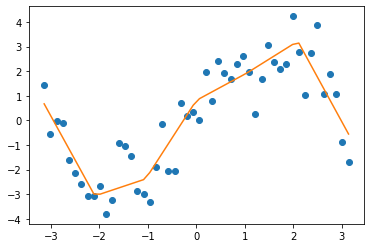
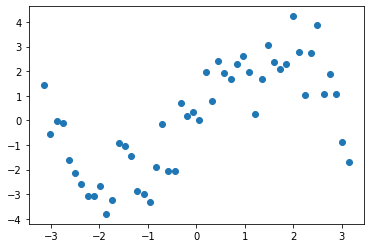
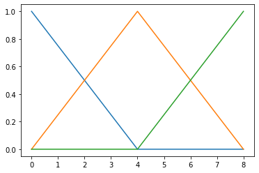

date: 2020-08-20
title: Трюк с аппроксимацией кусочно-линейной функцией
tags: GAM
Category: Stats

Разбираюсь с внутренним устройством аддитивных моделей, смотрю, как работает функция gam из пакета mgcv в R, параллельно читаю теорию в книге S. N. Wood, "Generalized Additive Models".

Наткнулся на восхитительный трюк, который не приходил мне в голову -- очень изящное решение часто возникающей задачи. Представим себе такую ситуацию: есть некоторое облако точек на плоскости (в многомерном пространстве аналогично, но на плоскости нагляднее). Мы хотим построить кусочно-линейную аппроксимацию этого облака. Основная идея, того, что хочется получить в итоге, показана на рисунке.



Оказывается, задачу можно решить буквально в несколько матричных умножений, логика там такая:

1. Требуется аппроксимировать некоторую функцию.
2. Будем работать с функциями как с элементами векторного пространства.
3. Вектор можно разложить на сумму базисных векторов, в нашем случае -- представить искомую фунцию в виде суммы 
   базисных функций.
4. Весь вопрос в подходящем выборе базиса и вычисления коэффициентов разложения.

## Детали

### Подготовительный этап

Сгенерируем пример, с которым будем работать:

```{python}
import numpy as np
import matplotlib.pyplot as plt


N = 50
x = np.linspace(-np.pi, np.pi, num=N)
y = 3*np.sin(x) + np.random.normal(size=N)

plt.plot(x, y, 'o')
```



Пусть область область определения неизвестной функции разбита на отрезки при помощи узловых точек:
$\{x_j: j=1, \dots, k\}$, $x_j > x_{j-1}$. 
В качестве базисных функций возьмем функции, определенные в окрестности узлов:

$$
b_j = \begin{cases} \frac{x-x_{j-1}}{x_j-x_{j-1}}, \qquad x_{j-1}< x \leq x_j\\ \frac{x_{j+1}-x}{x_{j+1}-x_j}, \qquad x_{j}< x \leq x_{j+1} \\ 0, \qquad \text{иначе}  \end{cases}
$$
А в начальном и конечном узле функции определяются так:

$$
b_1 = \begin{cases} \frac{x_{2}-x}{x_{2}-x_1}, \qquad x < x_{2} \\ 0, \qquad \text{иначе}  \end{cases}, 
$$
$$
b_k = \begin{cases} \frac{x-x_{k-1}}{x_k - x_{k-1}}, \qquad x >x_{k-1} \\ 0, \qquad \text{иначе}  \end{cases}
$$

Эти функции легко запрограммировать следующим образом:
```{python}
def tent(x, xj, j):
  dj = xj * 0
  dj[j] = 1
  interp = np.interp(x, xj, dj)

  return interp
```
Функция tent принимает на вход набор точек, для которых нужно вычилить значение функции, набор узлов и номер функции, например так выглядят три функции, заданные 
для узлов [0, 4, 8]:

```{python}
for j in [0, 1, 2]:
  plt.plot(range(9), tent(np.array(range(9)), np.array([0, 4, 8]), j))

```


Следующий шаг -- построение матрицы значений базисных функций в заданных точках. Для удобства определяем функцию:
```{python}
def tent_matrix(x, xj):
  nk = len(xj)
  n = len(x)
  X = np.zeros((n, nk))
  for j in range(nk):
    X[:, j] = tent(x, xj, j)

  return X
```
Например, постоим матрицу значений базисных функций в точках 0, 1, ... 8 для базисных функций, определяемых узлами 0, 4, 8:

```{python}
tent_matrix(np.array(range(9)), np.array([0, 4, 8]))

array([[1.  , 0.  , 0.  ],
       [0.75, 0.25, 0.  ],
       [0.5 , 0.5 , 0.  ],
       [0.25, 0.75, 0.  ],
       [0.  , 1.  , 0.  ],
       [0.  , 0.75, 0.25],
       [0.  , 0.5 , 0.5 ],
       [0.  , 0.25, 0.75],
       [0.  , 0.  , 1.  ]])
```

### Подгонка кривых
В общем-то сам этам расчетов состоит из поиска коэффициентов разложения аппроксимируемой функции на базисные функции методом наименьших квадратов:

```{python}
sj = np.linspace(-np.pi, np.pi, num=7)  # Выберем 7 базисных функций (узлов)

X = tent_matrix(x, sj)
b = np.linalg.lstsq(X, y)
appr = np.dot(X, b[0])

plt.plot(x, y, 'o', x, appr)
```
Результат работы показан на рисунке:


Для полноты картины выведу коэффициенты разложения:
```{python}
b[0]

array([ 0.67347735, -3.06728294, -2.3785451 ,  0.81588507,  1.93119414,
        3.22027169, -0.55155735])
```
